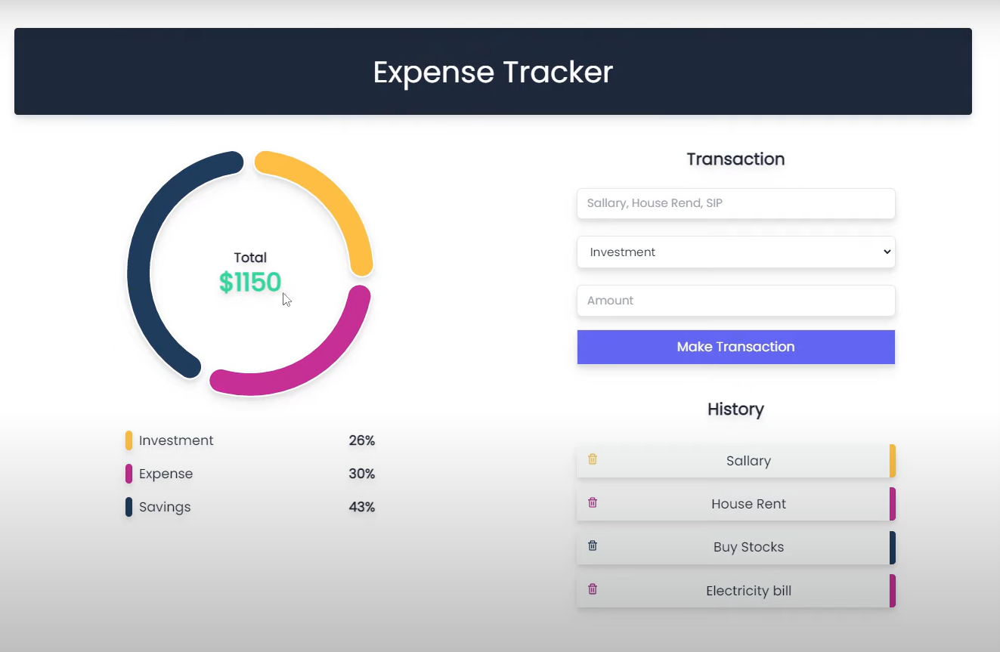

# Expenses-Tracker
# Expense Tracker Web Application

This Expense Tracker web application allows users to track their income and expenses. It is built using React with Redux for global state management and Chakra UI for styling.

## Preview




## Features

- Dashboard with components for tracking expenses, viewing analytics, and transaction history.
- Real-time data visualization using Chart.js.
- CRUD operations for transactions, with editing and deleting capabilities.
- Filtering and sorting transactions by type and date.

## Technologies Used

- React
- Redux
- Tailwind CSS
- Chart.js
- NodeJS
- MongoDB

## Installation

1. Clone the repository:

```bash
git clone https://github.com/Sonali020200/Expenses-Tracker.git
```
```bash
cd expense-tracker
```
```bash
cd server
```
```bash
npm install
```
```bash
npm run server
```
```bash
cd client
```
```bash
npm install
```
```bash
npm start
```

